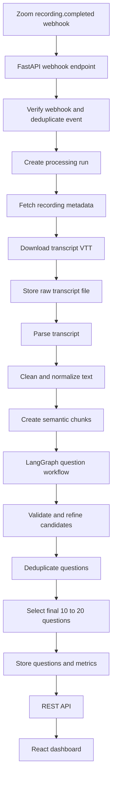
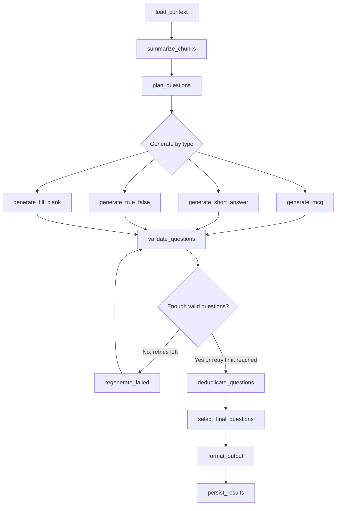

# Architecture

Project: Agentic AI for Automated Question Generation from Zoom Meeting Transcripts

Source of truth: `docs/PROJECT_SPECIFICATION.docx`, version 1.0, dated 01 June 2026.

## 1. System Overview

The system is a local-first application that converts Zoom meeting transcripts into validated assessment questions.

Core architecture layers:

| Layer | Responsibility | Technology |
| --- | --- | --- |
| Integration | Zoom webhook handling and transcript download | Zoom REST API, Zoom Webhooks |
| API | External and frontend-facing backend routes | FastAPI |
| Processing | transcript ingestion, parsing, cleaning, chunking, orchestration | Python services |
| AI Orchestration | agent state, graph nodes, routing, retries | LangGraph |
| LLM Runtime | local model inference | Ollama |
| Storage | relational records and local files | PostgreSQL, filesystem |
| Presentation | dashboard for generated questions and metrics | React + Vite |

## 2. High-Level Data Flow



## 3. Complete Folder Structure

```text
Zoom Agentic AI/
  PROJECT_PLAN.md
  PROJECT_STATUS.md
  HANDOVER.md
  ARCHITECTURE.md
  README.md
  .gitignore
  .env.example

  backend/
    README.md
    pyproject.toml
    alembic.ini
    app/
      __init__.py
      main.py
      core/
        __init__.py
        config.py
        logging.py
        errors.py
        security.py
      api/
        __init__.py
        router.py
        deps.py
        v1/
          __init__.py
          health.py
          webhooks.py
          meetings.py
          transcripts.py
          processing_runs.py
          questions.py
          metrics.py
          exports.py
      db/
        __init__.py
        session.py
        base.py
        models/
          __init__.py
          meeting.py
          transcript.py
          transcript_chunk.py
          processing_run.py
          question.py
          question_option.py
          webhook_event.py
          metric.py
          log_event.py
        repositories/
          __init__.py
          meetings.py
          transcripts.py
          runs.py
          questions.py
          metrics.py
      integrations/
        __init__.py
        zoom/
          __init__.py
          auth.py
          client.py
          schemas.py
          webhook.py
      services/
        __init__.py
        ingestion_service.py
        storage_service.py
        transcript_parser.py
        preprocessing_service.py
        chunking_service.py
        question_service.py
        metrics_service.py
      agent/
        __init__.py
        state.py
        graph.py
        schemas.py
        prompts/
          planner.md
          summarize_chunk.md
          generate_mcq.md
          generate_short_answer.md
          generate_true_false.md
          generate_fill_blank.md
          validate_question.md
          refine_question.md
          final_selection.md
        tools/
          __init__.py
          summarize_chunk.py
          generate_mcq.py
          generate_short_answer.py
          generate_true_false.py
          generate_fill_blank.py
          validate_question.py
          deduplicate_questions.py
          select_questions.py
          format_output.py
      llm/
        __init__.py
        ollama_client.py
        model_router.py
        output_parser.py
      workers/
        __init__.py
        processing_worker.py
        retry_policy.py
      schemas/
        __init__.py
        common.py
        meetings.py
        transcripts.py
        processing_runs.py
        questions.py
        metrics.py
      utils/
        __init__.py
        text.py
        time.py
        ids.py

    alembic/
      env.py
      versions/

  frontend/
    README.md
    package.json
    vite.config.ts
    index.html
    src/
      main.tsx
      App.tsx
      api/
        client.ts
        meetings.ts
        questions.ts
        processingRuns.ts
        metrics.ts
      components/
        layout/
          AppShell.tsx
          Sidebar.tsx
          TopBar.tsx
        meetings/
          MeetingList.tsx
          MeetingDetail.tsx
        questions/
          QuestionList.tsx
          QuestionCard.tsx
          QuestionFilters.tsx
        metrics/
          MetricsSummary.tsx
          RunTimeline.tsx
        common/
          EmptyState.tsx
          LoadingState.tsx
          ErrorState.tsx
      pages/
        DashboardPage.tsx
        MeetingsPage.tsx
        MeetingDetailPage.tsx
        RunsPage.tsx
      styles/
        globals.css
      types/
        api.ts

  database/
    README.md
    schema.sql
    seed/
      sample_meetings.sql

  docs/
    PROJECT_SPECIFICATION.docx
    api_contract.md
    prompt_strategy.md
    testing_strategy.md

  transcripts/
    raw/
    processed/
    failed/

  meeting_samples/
    transcripts/
    zoom_payloads/
    expected_outputs/

  tests/
    backend/
      unit/
      integration/
      e2e/
      performance/
      security/
    frontend/
      unit/
      e2e/
    fixtures/

  logs/
    app/
    processing/

  screenshots/
```

## 4. Backend Module Design

### 4.1 Configuration Module

Responsibilities:

- Load environment variables.
- Validate required Zoom, database, storage, and Ollama settings.
- Provide central settings object.
- Define defaults for question count, chunk size, timeouts, and model names.

### 4.2 Zoom Integration Module

Responsibilities:

- Verify Zoom webhook payloads.
- Handle Zoom URL validation event if required by webhook setup.
- Deduplicate webhook events.
- Retrieve Server-to-Server OAuth access token.
- Query recording metadata.
- Locate transcript file.
- Download transcript file safely.

### 4.3 Transcript Processing Module

Responsibilities:

- Parse VTT transcript files.
- Extract timestamps, speaker labels, and text.
- Remove filler words, repeated phrases, non-verbal annotations, formatting artifacts, and excessive whitespace.
- Preserve known speaker names.
- Use fallback labels such as `Speaker 1` and `Speaker 2` when names are missing.
- Create semantic chunks using topic boundaries, sentence similarity, and token constraints.
- Attach metadata to chunks:
  - meeting title
  - meeting date
  - participant list
  - chunk identifier
  - timestamp range

### 4.4 Agentic AI Module

Responsibilities:

- Build and run the LangGraph workflow.
- Maintain graph state.
- Plan question type distribution.
- Summarize transcript chunks.
- Generate MCQ, short answer, true/false, and fill-in-the-blank questions.
- Validate generated questions.
- Regenerate invalid candidates.
- Deduplicate semantically similar questions.
- Select final 10 to 20 questions.
- Format output for storage and API response.

### 4.5 LLM Module

Responsibilities:

- Call Ollama local API.
- Use Qwen 3 8B as primary model.
- Use Llama 3 8B as fallback model.
- Apply request timeouts and retry policy.
- Parse structured JSON model output.
- Capture token/time metrics when available.

### 4.6 Persistence Module

Responsibilities:

- Store meetings, transcripts, chunks, runs, questions, options, metrics, and webhook events.
- Track processing lifecycle.
- Expose repositories to service layer.
- Keep database models separate from API schemas.

### 4.7 Frontend Module

Responsibilities:

- Display meetings.
- Display processing run status.
- Display generated questions.
- Filter questions by type, difficulty, confidence, and meeting.
- Display metrics:
  - processing duration
  - number of generated questions
  - validation success rate
  - question type distribution

## 5. PostgreSQL Schema Design

This is a logical schema design. Implementation migrations should be created only after approval.

### 5.1 Enum-Like Values

Use database enums or constrained text values during implementation.

| Name | Values |
| --- | --- |
| `meeting_source` | `zoom`, `manual_upload` |
| `transcript_status` | `uploaded`, `downloaded`, `parsed`, `chunked`, `failed` |
| `run_status` | `queued`, `running`, `completed`, `failed`, `cancelled` |
| `question_type` | `mcq`, `short_answer`, `true_false`, `fill_blank` |
| `difficulty` | `easy`, `medium`, `hard` |
| `validation_status` | `pending`, `passed`, `failed`, `regenerated`, `discarded` |

### 5.2 Tables

#### `meetings`

| Column | Type | Notes |
| --- | --- | --- |
| `id` | UUID PK | Internal meeting ID |
| `source` | text | `zoom` or `manual_upload` |
| `zoom_meeting_id` | text nullable | Zoom meeting identifier |
| `zoom_uuid` | text nullable unique | Zoom meeting UUID when available |
| `topic` | text | Meeting topic/title |
| `start_time` | timestamptz nullable | Meeting start time |
| `duration_minutes` | integer nullable | Zoom duration if available |
| `host_id` | text nullable | Zoom host ID |
| `host_email` | text nullable | Zoom host email |
| `participant_count` | integer nullable | Participant count if available |
| `metadata` | jsonb | Raw or enriched meeting metadata |
| `created_at` | timestamptz | Record creation time |
| `updated_at` | timestamptz | Record update time |

Indexes:

- `zoom_uuid`
- `zoom_meeting_id`
- `start_time`

#### `webhook_events`

| Column | Type | Notes |
| --- | --- | --- |
| `id` | UUID PK | Internal event ID |
| `event_type` | text | Example: `recording.completed` |
| `zoom_event_id` | text nullable unique | Event identifier if Zoom provides one |
| `meeting_id` | UUID FK nullable | Linked after meeting record exists |
| `payload` | jsonb | Full webhook payload |
| `headers` | jsonb | Relevant request headers |
| `received_at` | timestamptz | Receipt time |
| `processed_at` | timestamptz nullable | Processing completion time |
| `status` | text | `received`, `processed`, `ignored`, `failed` |
| `error_message` | text nullable | Failure reason |

Indexes:

- `event_type`
- `zoom_event_id`
- `received_at`

#### `transcripts`

| Column | Type | Notes |
| --- | --- | --- |
| `id` | UUID PK | Internal transcript ID |
| `meeting_id` | UUID FK | Parent meeting |
| `source_format` | text | `vtt`, `json`, or future format |
| `status` | text | Transcript lifecycle status |
| `raw_file_path` | text | Local raw transcript path |
| `processed_file_path` | text nullable | Optional normalized output path |
| `file_size_bytes` | bigint nullable | Raw file size |
| `checksum_sha256` | text nullable | Integrity check |
| `language` | text nullable | Expected `en` in phase 1 |
| `segment_count` | integer nullable | Parsed segment count |
| `word_count` | integer nullable | Parsed word count |
| `parse_error` | text nullable | Parser failure reason |
| `created_at` | timestamptz | Record creation time |
| `updated_at` | timestamptz | Record update time |

Indexes:

- `meeting_id`
- `status`
- `checksum_sha256`

#### `transcript_segments`

| Column | Type | Notes |
| --- | --- | --- |
| `id` | UUID PK | Segment ID |
| `transcript_id` | UUID FK | Parent transcript |
| `sequence_number` | integer | Original order |
| `speaker_label` | text nullable | Speaker name or fallback label |
| `start_seconds` | numeric nullable | Segment start |
| `end_seconds` | numeric nullable | Segment end |
| `text` | text | Segment text |
| `cleaned_text` | text nullable | Cleaned segment text |
| `created_at` | timestamptz | Record creation time |

Indexes:

- `(transcript_id, sequence_number)`
- `(transcript_id, start_seconds)`

#### `transcript_chunks`

| Column | Type | Notes |
| --- | --- | --- |
| `id` | UUID PK | Chunk ID |
| `transcript_id` | UUID FK | Parent transcript |
| `chunk_index` | integer | Chunk order |
| `title` | text nullable | Optional topic label |
| `start_seconds` | numeric nullable | First segment start |
| `end_seconds` | numeric nullable | Last segment end |
| `text` | text | Chunk text |
| `summary` | text nullable | Optional LLM or algorithm summary |
| `token_estimate` | integer nullable | Estimated token count |
| `metadata` | jsonb | Topic, speakers, boundaries |
| `created_at` | timestamptz | Record creation time |

Indexes:

- `(transcript_id, chunk_index)`
- `token_estimate`

#### `processing_runs`

| Column | Type | Notes |
| --- | --- | --- |
| `id` | UUID PK | Run ID |
| `meeting_id` | UUID FK | Parent meeting |
| `transcript_id` | UUID FK | Parent transcript |
| `status` | text | `queued`, `running`, `completed`, `failed`, `cancelled` |
| `trigger_source` | text | `webhook`, `manual`, `retry` |
| `model_primary` | text | Example: Qwen 3 8B Ollama model name |
| `model_fallback` | text nullable | Example: Llama 3 8B |
| `question_min_count` | integer | Usually 10 |
| `question_max_count` | integer | Usually 20 |
| `started_at` | timestamptz nullable | Run start time |
| `completed_at` | timestamptz nullable | Run completion time |
| `duration_ms` | integer nullable | Execution duration |
| `error_message` | text nullable | Failure reason |
| `config` | jsonb | Chunk limits, prompt version, retry settings |
| `created_at` | timestamptz | Record creation time |
| `updated_at` | timestamptz | Record update time |

Indexes:

- `(meeting_id, created_at)`
- `status`
- `created_at`

#### `questions`

| Column | Type | Notes |
| --- | --- | --- |
| `id` | UUID PK | Internal question ID |
| `run_id` | UUID FK | Generation run |
| `meeting_id` | UUID FK | Parent meeting for easier querying |
| `chunk_id` | UUID FK nullable | Source chunk |
| `question_number` | integer | Final display order |
| `question_type` | text | `mcq`, `short_answer`, `true_false`, `fill_blank` |
| `difficulty` | text | `easy`, `medium`, `hard` |
| `question_text` | text | Generated question |
| `correct_answer` | text nullable | Correct answer for MCQ, true/false, fill blank |
| `model_answer` | text nullable | Expected answer for short answer |
| `source_segment` | text | Transcript evidence |
| `source_start_seconds` | numeric nullable | Evidence start |
| `source_end_seconds` | numeric nullable | Evidence end |
| `confidence` | numeric | 0.00 to 1.00 |
| `validation_status` | text | Final validation state |
| `validation_notes` | text nullable | Reasoning summary, not chain-of-thought |
| `metadata` | jsonb | Prompt version, model, retries |
| `created_at` | timestamptz | Record creation time |

Indexes:

- `(run_id, question_number)`
- `(meeting_id, question_type)`
- `confidence`
- `difficulty`

#### `question_options`

| Column | Type | Notes |
| --- | --- | --- |
| `id` | UUID PK | Option ID |
| `question_id` | UUID FK | Parent question |
| `option_label` | text | `A`, `B`, `C`, `D` |
| `option_text` | text | Option text |
| `is_correct` | boolean | Correct option flag |
| `created_at` | timestamptz | Record creation time |

Indexes:

- `(question_id, option_label)`

#### `question_candidates`

| Column | Type | Notes |
| --- | --- | --- |
| `id` | UUID PK | Candidate ID |
| `run_id` | UUID FK | Parent run |
| `chunk_id` | UUID FK nullable | Source chunk |
| `question_type` | text | Candidate type |
| `payload` | jsonb | Raw structured candidate |
| `validation_status` | text | Candidate status |
| `confidence` | numeric nullable | Candidate score |
| `failure_reason` | text nullable | Why rejected |
| `retry_count` | integer | Regeneration attempts |
| `created_at` | timestamptz | Record creation time |

Indexes:

- `run_id`
- `validation_status`
- `(run_id, question_type)`

#### `run_metrics`

| Column | Type | Notes |
| --- | --- | --- |
| `id` | UUID PK | Metric ID |
| `run_id` | UUID FK | Parent run |
| `metric_name` | text | Metric key |
| `metric_value` | numeric nullable | Numeric value |
| `metric_text` | text nullable | Text value if needed |
| `metadata` | jsonb | Extra context |
| `created_at` | timestamptz | Record creation time |

Recommended metrics:

- `processing_duration_ms`
- `generated_candidate_count`
- `final_question_count`
- `validation_success_rate`
- `mcq_count`
- `short_answer_count`
- `true_false_count`
- `fill_blank_count`
- `deduplicated_count`
- `regenerated_count`

#### `log_events`

| Column | Type | Notes |
| --- | --- | --- |
| `id` | UUID PK | Log event ID |
| `run_id` | UUID FK nullable | Related processing run |
| `meeting_id` | UUID FK nullable | Related meeting |
| `level` | text | `debug`, `info`, `warning`, `error` |
| `event_name` | text | Structured event key |
| `message` | text | Human-readable log message |
| `context` | jsonb | Request ID, model, node, exception details |
| `created_at` | timestamptz | Log time |

Indexes:

- `(run_id, created_at)`
- `level`
- `event_name`

## 6. API Route Design

Version prefix: `/api/v1`

### 6.1 Health Routes

| Method | Route | Purpose |
| --- | --- | --- |
| `GET` | `/health` | Basic app health |
| `GET` | `/ready` | Database, storage, and Ollama readiness |

### 6.2 Zoom Webhook Routes

| Method | Route | Purpose |
| --- | --- | --- |
| `POST` | `/webhooks/zoom` | Receive Zoom webhook events including `recording.completed` |
| `GET` | `/webhooks/zoom/events/{event_id}` | Inspect stored webhook event for debugging |

Notes:

- Must verify Zoom signature/secret token.
- Must handle Zoom endpoint validation challenge if configured.
- Must deduplicate repeated events.
- Should return quickly and process long-running work in background.

### 6.3 Manual Ingestion Routes

| Method | Route | Purpose |
| --- | --- | --- |
| `POST` | `/transcripts/upload` | Upload a local VTT transcript for development/testing |
| `GET` | `/transcripts/{transcript_id}` | Fetch transcript metadata |
| `GET` | `/transcripts/{transcript_id}/segments` | List parsed transcript segments |
| `GET` | `/transcripts/{transcript_id}/chunks` | List transcript chunks |

### 6.4 Meeting Routes

| Method | Route | Purpose |
| --- | --- | --- |
| `GET` | `/meetings` | List meetings with filters |
| `GET` | `/meetings/{meeting_id}` | Get meeting detail |
| `GET` | `/meetings/{meeting_id}/transcripts` | List transcripts for meeting |
| `GET` | `/meetings/{meeting_id}/questions` | Get final generated questions for meeting |
| `GET` | `/meetings/{meeting_id}/metrics` | Get latest metrics summary |

Suggested filters for `GET /meetings`:

- `source`
- `from_date`
- `to_date`
- `status`
- `limit`
- `offset`

### 6.5 Processing Run Routes

| Method | Route | Purpose |
| --- | --- | --- |
| `POST` | `/processing-runs` | Start processing for an existing transcript |
| `GET` | `/processing-runs` | List processing runs |
| `GET` | `/processing-runs/{run_id}` | Get run status/detail |
| `POST` | `/processing-runs/{run_id}/retry` | Retry failed run |
| `POST` | `/processing-runs/{run_id}/cancel` | Cancel queued/running run if supported |
| `GET` | `/processing-runs/{run_id}/metrics` | Get run metrics |
| `GET` | `/processing-runs/{run_id}/logs` | Get run log events |

### 6.6 Question Routes

| Method | Route | Purpose |
| --- | --- | --- |
| `GET` | `/questions` | List questions with filters |
| `GET` | `/questions/{question_id}` | Get question detail |
| `GET` | `/questions/{question_id}/source` | Get source segment/chunk evidence |

Suggested filters for `GET /questions`:

- `meeting_id`
- `run_id`
- `question_type`
- `difficulty`
- `min_confidence`
- `validation_status`
- `limit`
- `offset`

### 6.7 Export Routes

| Method | Route | Purpose |
| --- | --- | --- |
| `GET` | `/exports/meetings/{meeting_id}/questions.json` | Export meeting questions as JSON |
| `GET` | `/exports/runs/{run_id}/questions.json` | Export run output as JSON |

Initial implementation should focus on JSON. LMS exports are future work.

## 7. API Response Design

Final question JSON should follow the intent of the approved specification:

```json
{
  "meeting_id": "uuid",
  "topic": "Weekly Sync",
  "date": "2026-05-30T14:00:00Z",
  "questions": [
    {
      "id": "uuid",
      "type": "mcq",
      "difficulty": "medium",
      "question": "What was the primary reason for the delay in Project Alpha?",
      "options": [
        { "label": "A", "text": "Budget reallocation" },
        { "label": "B", "text": "Vendor dependency" },
        { "label": "C", "text": "Team restructuring" },
        { "label": "D", "text": "Regulatory approval" }
      ],
      "correct_answer": "B",
      "source_segment": "Speaker 1 (02:34): ...",
      "confidence": 0.94
    }
  ],
  "metadata": {
    "generated_by": "agentic-qa-v1.0",
    "timestamp": "2026-05-30T15:30:00Z",
    "total_questions": 17
  }
}
```

## 8. LangGraph Workflow Design

### 8.1 State Fields

Planned graph state:

| Field | Purpose |
| --- | --- |
| `run_id` | Current processing run |
| `meeting` | Meeting metadata |
| `transcript_id` | Transcript record |
| `chunks` | Preprocessed transcript chunks |
| `question_plan` | Desired distribution by question type and chunk |
| `chunk_summaries` | Summaries/key points per chunk |
| `candidates` | Generated question candidates |
| `validated_candidates` | Candidates that passed validation |
| `rejected_candidates` | Failed candidates and reasons |
| `deduplicated_questions` | Candidates after similarity filtering |
| `final_questions` | Selected 10 to 20 final questions |
| `metrics` | Counts, durations, success rates |
| `errors` | Recoverable/non-recoverable workflow errors |

### 8.2 Node Design

| Node | Responsibility | Output |
| --- | --- | --- |
| `load_context` | Load meeting, transcript, chunks, config | hydrated state |
| `summarize_chunks` | Extract key points from chunks | chunk summaries |
| `plan_questions` | Determine distribution by type and topic | question plan |
| `generate_mcq` | Generate MCQ candidates | candidate questions |
| `generate_short_answer` | Generate short answer candidates | candidate questions |
| `generate_true_false` | Generate true/false candidates | candidate questions |
| `generate_fill_blank` | Generate fill-in-the-blank candidates | candidate questions |
| `validate_questions` | Check grounding, clarity, relevance, completeness | passed/failed candidates |
| `regenerate_failed` | Retry invalid candidates within limits | replacement candidates |
| `deduplicate_questions` | Remove duplicates and near-duplicates | unique candidates |
| `select_final_questions` | Select best 10 to 20 by coverage/diversity/confidence | final question set |
| `format_output` | Convert to API/storage schema | structured output |
| `persist_results` | Save questions, options, metrics, logs | database records |

### 8.3 Workflow Diagram



### 8.4 Question Planning Rules

Default distribution from the approved specification:

| Type | Target Share |
| --- | --- |
| MCQ | 40 percent |
| Short Answer | 30 percent |
| True/False | 20 percent |
| Fill in the Blank | 10 percent |

The planner should adapt based on transcript content. For example:

- Action-item-heavy meetings may produce more short-answer questions.
- Fact-dense chunks may produce more MCQ and fill-in-the-blank questions.
- Sparse or ambiguous chunks should generate fewer questions.

### 8.5 Validation Criteria

Each question must be checked for:

- Relevance to transcript content.
- Clarity and grammatical quality.
- Completeness.
- Context correctness.
- Answerability using only transcript information.
- Source segment availability.
- No hallucinated unsupported facts.
- MCQ distractor plausibility.
- No duplicate or near-duplicate wording.

### 8.6 Final Selection Criteria

Final questions should be selected based on:

- Topic coverage.
- Question type diversity.
- Difficulty balance.
- Confidence score.
- Source evidence quality.
- Avoidance of duplicates.
- Total count between 10 and 20.

## 9. Logging and Metrics

Logs should include:

- Webhook receipt and validation status.
- Transcript download status.
- Parser and chunking status.
- LangGraph node start/end events.
- Validation outcomes.
- Regeneration attempts.
- Deduplication results.
- Final question count.
- Execution time.
- Errors and recovery actions.

Metrics should include:

- Processing duration.
- Number of transcript segments.
- Number of chunks.
- Candidate question count.
- Final question count.
- Validation success rate.
- Question type distribution.
- Regeneration count.
- Deduplicated count.
- Model call duration if available.

## 10. Security Design

Security controls:

- Store Zoom credentials in environment variables.
- Do not commit `.env` files.
- Validate Zoom webhook signatures/secrets.
- Deduplicate webhook events to avoid repeated processing.
- Validate uploaded transcript file type and size.
- Sanitize filenames and use controlled storage paths.
- Avoid exposing raw secrets in logs.
- Use parameterized database access through ORM/query builder.
- Restrict CORS to known frontend origins during implementation.

## 11. Testing Design

### Unit Tests

- VTT parsing.
- Transcript cleaning.
- Speaker fallback labeling.
- Chunk boundary generation.
- Question output schema validation.
- Deduplication logic.

### Integration Tests

- Manual upload to transcript record.
- Database repositories.
- Processing run lifecycle.
- API route responses.
- Ollama client with mocked responses.
- LangGraph workflow with deterministic test model output.

### End-to-End Tests

- Ingest sample transcript.
- Run full preprocessing and generation pipeline.
- Verify 10 to 20 final questions.
- Verify source segments and confidence values.
- Verify dashboard can display results.

### Performance Tests

- 1-hour transcript processing time.
- Memory usage.
- API response time.
- Model call duration per chunk.

### Security Tests

- Invalid file upload rejection.
- Oversized file rejection.
- Invalid webhook signature rejection.
- Input sanitization.
- Database safety through repository APIs.

## 12. Future Extension Points

- Microsoft Teams transcript integration.
- LMS export formats.
- Multi-user authentication.
- Non-English transcript support.
- Human review/edit workflow.
- Question bank versioning.
- Rubric generation.
- Difficulty calibration using feedback data.
- Background job queue if local synchronous processing becomes limiting.

